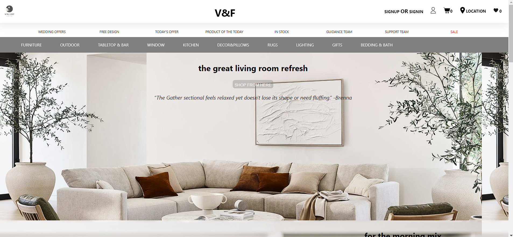
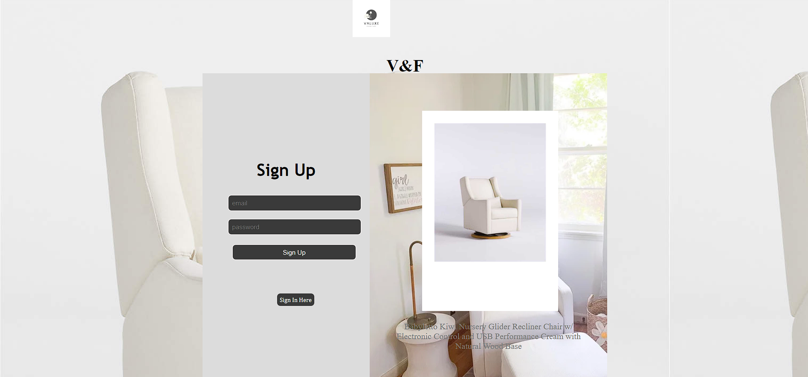
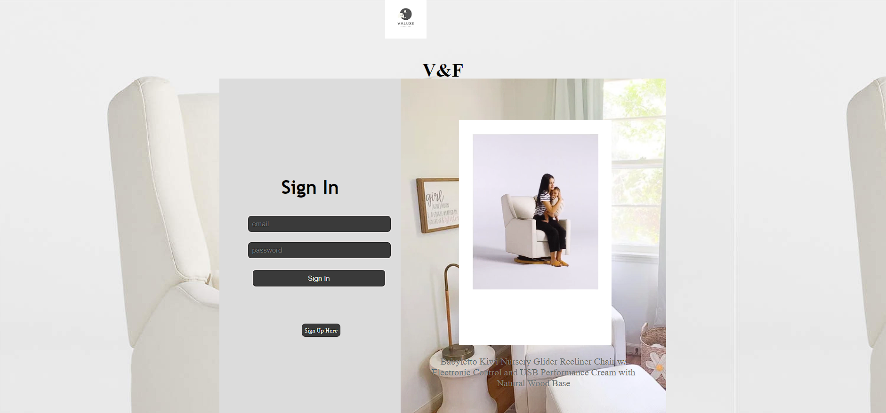
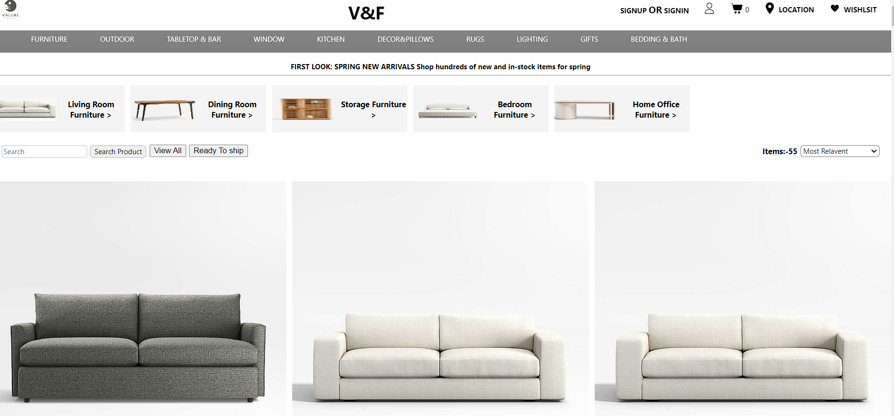
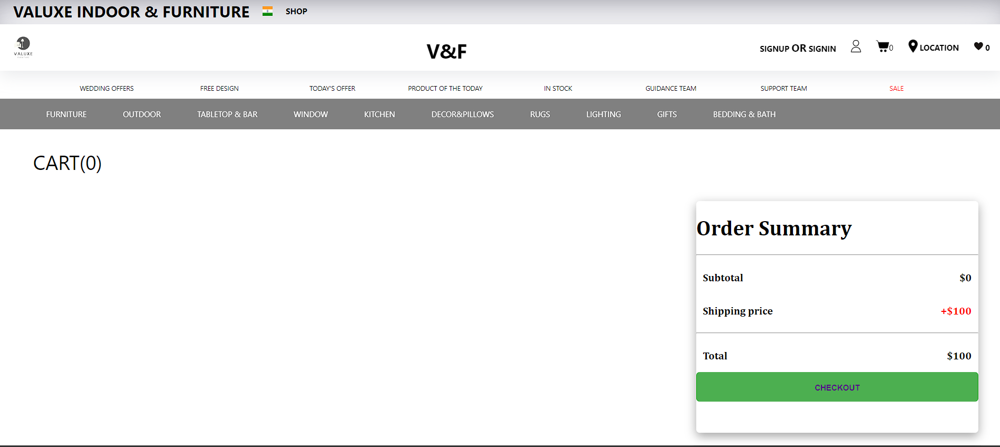

# Valuxe - Crate & Barrel Ecommerce Furniture Clone

Valuxe is an ecommerce furniture clone website inspired by Crate & Barrel. It is a solo project developed  in a time span of 5 days using HTML, CSS, and JavaScript only, without any external libraries. The website aims to replicate the core functionalities of Crate & Barrel, allowing users to browse furniture, search for products, filter by price, add items to the cart, sign up for an account, and log in

## Technology

- HTML
- CSS
- JavaScript

## Deployment
You can access the live deployed version of Valuxe by clicking the link below:

 <a href="https://gleeful-hamster-fcba8a.netlify.app/">Live demo</a>

## Features and Functionality

- **Browse Furniture:** Users can explore a wide range of furniture products available on Valuxe.

- **Search:** The website provides a search functionality, allowing users to find specific products based on keywords.

- **Filter by Price:** Users can filter furniture items based on their price range to narrow down their search.

- **Add to Cart:** Customers can add desired furniture pieces to their shopping cart for purchase.

- **Signup:** Users can create an account on Valuxe by providing essential details.

- **Login:** Registered users can log in to their accounts to access additional features and view order history.

## Screenshots
Main Page
    

SignUp Page
    

SignIn Page
    

Product Page
    

Cart Page
    

